#  Domain Generalization and Foundation Model in Medical Image Analysis

🔥 This is a repository for organizing papers ,codes, and etc related to **Domain Generalization and Foundation model in Medical Image Analysis (DG&FM in MedIA)**.

<!-- 💗 Medical Image Analysis (MedIA) plays a critical role in computer aided diagnosis system, enabling accurate diagnosis and assessment for various diseases. Over the last decade, deep learning (DL) has demonstrated great success in automating various MedIA tasks such as disease diagnosis, lesion segmentation, prognosis prediction, etc. Despite their success, in many real-world healthcare scenarios, the difference in the image acquisition, such as device manufacturer, scanning protocol, image sequence, and modality, introduces domain shifts, resulting in a significant decline in performance when deploying the well-trained model to clinical sites with different data distributions. Additionally, considering that medical data involves privacy concerns, data sharing restrictions and requires manual annotations by medical experts, collecting data from all possible domains to train DL models is expensive and even prohibitively impossible. Therefore, enhancing the generalization ability of DL models in MedIA is crucial in both clinical and academic fields. -->
💗 Medical Image Analysis (MedIA) plays a critical role in computer aided diagnosis system, enabling accurate diagnosis and assessment for various diseases. Over the last decade, deep learning (DL) has demonstrated great success in automating various MedIA tasks such as disease diagnosis, lesion segmentation, prognosis prediction, etc. Despite their success, in many real-world healthcare scenarios, the difference in the image acquisition, such as device manufacturer, scanning protocol, image sequence, and modality, introduces domain shifts, resulting in a significant decline in performance when deploying the well-trained model to clinical sites with different data distributions. Therefore, enhancing the generalization ability of DL models in MedIA is crucial in both clinical and academic fields. 
Domain generalization (DG), as an effective method to improve the generalization performance of task-specific models, can effectively mitigate the performance degradation caused by domain shifts in medical images, such as cross-center, cross-sequence, and cross-modality variations. Recently, with the explosive growth of data and advancements in computational resources, Foundation Model (FM) has addressed the domain shift issue in a more direct manner by collecting a vast amount of diverse data, effectively preventing domain shifts at the source. It can handle a wide variety of tasks, including entirely new tasks that it has never encountered before.
However, compared to task-specific DG models, FM offers increased task diversity and flexibility. Nonetheless, challenges such as medical data privacy concerns, data-sharing restrictions, the need for manual annotations by medical experts, and deployment demands persist. Therefore, we maintain that both DG and FM have their own merits and continue to hold significant research value.

🎯 We hope that this repository can provide assistance to researchers and practitioners in medical image analysis and domain generalization.

🚀 New Updates:
- **06/01/2025 :** We have modified the presentation format to a table, which makes it easier for readers to review.
- **25/12/2024 :** We have added a Universal Segmentation Foundational Model branch.
- **08/02/2024 :** We released this repo for organizing papers ,codes, and etc related to domain generalization for medical image analysis.

# Table of Contents
- [ Domain Generalization and Foundation Model in Medical Image Analysis](#-domain-generalization-and-foundation-model-in-medical-image-analysis)
- [Table of Contents](#table-of-contents)
- [Papers on Domian Generalization (ongoing)](#papers-on-domian-generalization-ongoing)
  - [Data Manipulation Level](#data-manipulation-level)
    - [Data Augmentation](#data-augmentation)
      - [Normalization-based](#normalization-based)
      - [Randomization-based](#randomization-based)
      - [Adversarial-based](#adversarial-based)
    - [Data Generation](#data-generation)
  - [Feature Level Generalization](#feature-level-generalization)
    - [Invariant Feature Representation](#invariant-feature-representation)
      - [Feature normalization](#feature-normalization)
      - [Explicit feature alignment](#explicit-feature-alignment)
      - [Domain adversarial learning](#domain-adversarial-learning)
    - [Feature disentanglement](#feature-disentanglement)
      - [Multi-component learning](#multi-component-learning)
      - [Generative Learning](#generative-learning)
  - [Model Training Level](#model-training-level)
    - [Learning Strategy](#learning-strategy)
      - [Ensemble Learning](#ensemble-learning)
      - [Meta Learning](#meta-learning)
      - [Self-supervised Learning](#self-supervised-learning)
    - [Optimization Strategy](#optimization-strategy)
  - [Model Test Level](#model-test-level)
    - [Test-time Adaptation](#test-time-adaptation)
  - [Universal Foundation Model](#universal-foundation-model)
    - [Survey](#survey)
    - [Visual Prompted Models](#visual-prompted-models)
      - [Interactive](#interactive)
      - [Few-shot/One-shot](#few-shotone-shot)
    - [Textual Prompted Models](#textual-prompted-models)
      - [Contrastive](#contrastive)
      - [Generative](#generative)
      - [Conversational](#conversational)
- [Datasets](#datasets)
- [Libraries](#libraries)
- [Other Resources](#other-resources)
- [Contact](#contact)
- [Acknowledgements](#acknowledgements)
- [Contributors](#contributors)

# Papers on Domian Generalization (ongoing)

## Data Manipulation Level
### Data Augmentation 
> Augmentation is widely employed in vision tasks to mitigate overfitting and improve generalization capacity, including operations like flipping, cropping, color jittering, noise addition, and others. For domain generalization in medical image analysis, augmentation methods can be broadly categorized as randomization-based, adversarial-based, and normalization-based.

#### Normalization-based
Normalization-based methods aims to normalize the raw intensity values or statistics to reduce the impact of variations in image intensity across different domains. Specifically, these methods are usually employed for specific tasks, such as pathological images testtest.

| Diagram | Descriptions |
|:-----------------:|:------------|
| 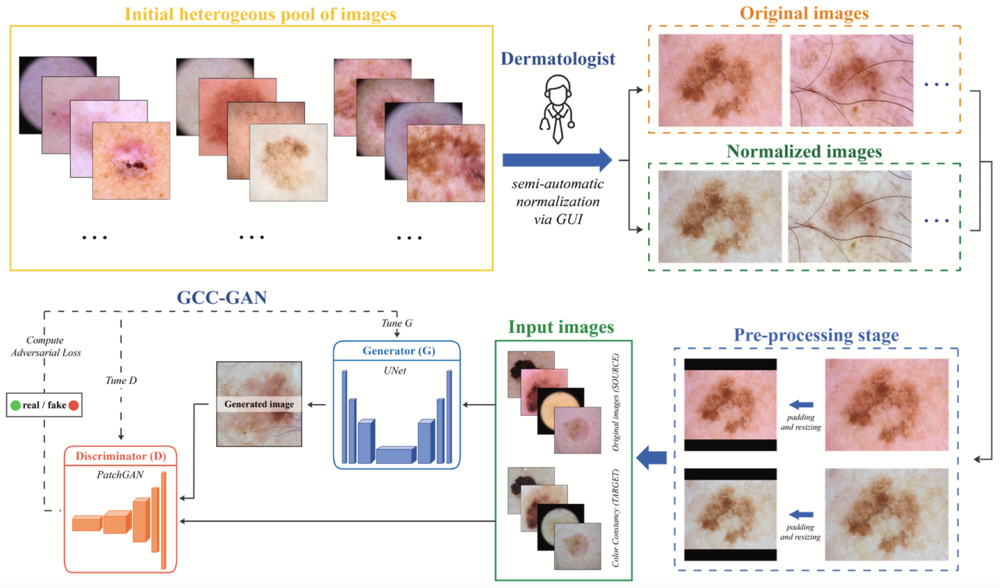 |<li> Title: <a href="https://www.sciencedirect.com/science/article/pii/S0957417423036096">Generative models for color normalization in digital pathology and dermatology: Advancing the learning paradigm</a></li> <li>Publication: Expert Systems with Applications 2024 </li> <li>Summary: Formulate the color normalization task as an image-to-image translation problem, ensuring a pixel-to-pixel correspondence between the original and normalized images. </li>|
|  |<li> Title: <a href="https://link.springer.com/chapter/10.1007/978-3-031-16434-7_15">Improved Domain Generalization for Cell Detection in Histopathology Images via Test-Time Stain Augmentation</a></li> <li>Publication: MICCAI 2022 </li> <li>Summary: Propose a test-time stain normalization method for cell detection in histopathology images, which transforms the test images by mixing their stain color with that of the source domain, so that the mixed images may better resemble the source images or their stain-transformed versions used for training. </li>|
|  |<li> Title: <a href="https://link.springer.com/chapter/10.1007/978-3-031-33658-4_22">Tackling Mitosis Domain Generalization in Histopathology Images with Color Normalization</a></li> <li>Publication: MICCAI Challenge 2022 </li> <li>Summary: Employ a color normalization method in their architecture for mitosis detection in histopathology images. </li>|
| 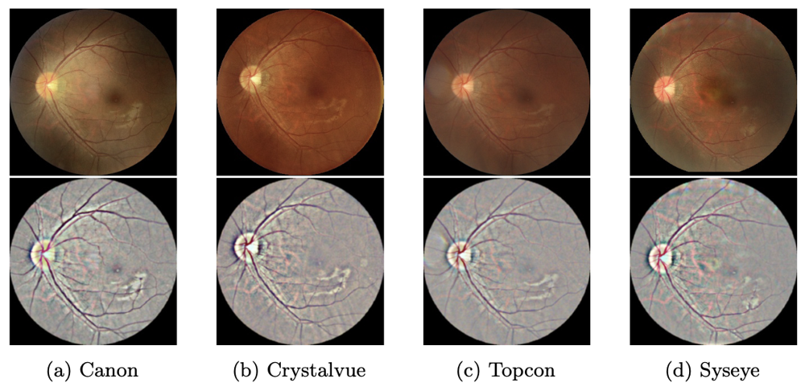 |<li> Title: <a href="https://link.springer.com/chapter/10.1007/978-3-030-59713-9_42">Improve Unseen Domain Generalization via Enhanced Local Color Transformation</a></li> <li>Publication: MICCAI 2020 </li> <li>Summary: Propose Enhanced Domain Transformation (EDT) for diabetic retinopathy classification, which aims to project the images into a color space that aligns the distribution of source data and unseen target data. </li>|

#### Randomization-based
The goal of randomization-based methods is to generate novel input data by applying random transformations to the image-space, frequency-space and feature space.

**Image-space**

| Diagram | Descriptions |
|:-----------------:|:------------|
|  |<li> Title: <a href="https://link.springer.com/chapter/10.1007/978-3-030-59713-9_42">Rethinking Data Augmentation for Single-Source Domain Generalization in Medical Image Segmentation</a></li> <li>Publication: AAAI 2023 </li> <li>Summary: Rethink the data augmentation strategy for DG in medical image segmentation and propose a location-scale augmentation strategy, which performs constrained Bezier transformation on both global and local (i.e. class-level) regions to enrich the informativeness and diversity of augmented. </li> <li> Code: <a href="https://github.com/Kaiseem/SLAug">https://github.com/Kaiseem/SLAug</a></li>|
| 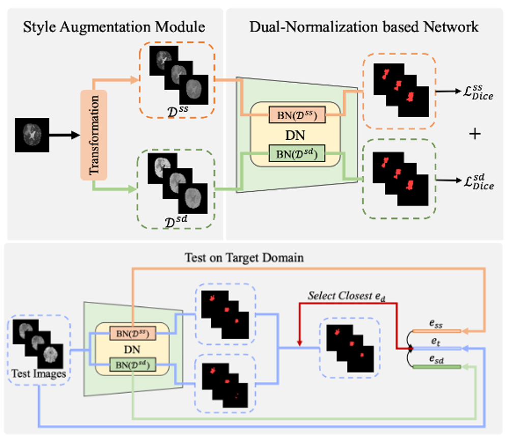 |<li> Title: <a href="https://openaccess.thecvf.com/content/CVPR2022/html/Zhou_Generalizable_Cross-Modality_Medical_Image_Segmentation_via_Style_Augmentation_and_Dual_CVPR_2022_paper.html">Generalizable Cross-modality Medical Image Segmentation via Style Augmentation and Dual Normalization</a></li> <li>Publication: CVPR 2022 </li> <li>Summary: Employ Bezier Curves to augment single source domain into different styles and split them into source-similar domain and source-dissimilar domain. </li> <li> Code: <a href="https://github.com/zzzqzhou/Dual-Normalization">https://github.com/zzzqzhou/Dual-Normalization</a></li>|
|  |<li> Title: <a href="https://ieeexplore.ieee.org/abstract/document/8995481">Generalizing Deep Learning for Medical Image Segmentation to Unseen Domains via Deep Stacked Transformation</a></li> <li>Publication: IEEE TMI 2020 </li> <li>Summary: Propose a deep stacked transformation approach by applying extensive random typical transformations on a single source domain to simulate the domain shift. </li>|

**Frequency-space**

| Diagram | Descriptions |
|:-----------------:|:------------|
|  |<li> Title: <a href="https://link.springer.com/chapter/10.1007/978-3-031-43987-2_13">Frequency-Mixed Single-Source Domain Generalization for Medical Image Segmentation</a></li> <li>Publication: MICCAI 2023 </li> <li>Summary: Present FMAug that extends the domain margin by mixing patches from diverse frequency views. </li>    <li> Code: <a href="https://github.com/liamheng/Non-IID_Medical_Image_Segmentation">https://github.com/liamheng/Non-IID_Medical_Image_Segmentation</a></li>|
| 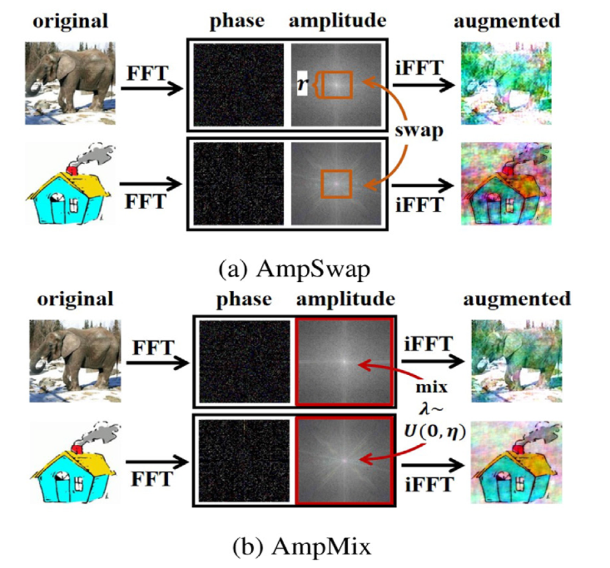 |<li> Title: <a href="https://www.sciencedirect.com/science/article/pii/S0031320323001747">Fourier-based augmentation with applications to domain generalization</a></li> <li>Publication: Pattern Recognition 2023 </li> <li>Summary: Propose a Fourier-based data augmentation strategy called AmpMix by linearly interpolating the amplitudes of two images while keeping their phases unchanged to simulated domain shift. Additionally a consistency training between different augmentation views is incorporated to learn invariant representation. </li> <li> Code: <a href="https://github.com/MediaBrain-SJTU/FACT">https://github.com/MediaBrain-SJTU/FACT</a></li>|
| 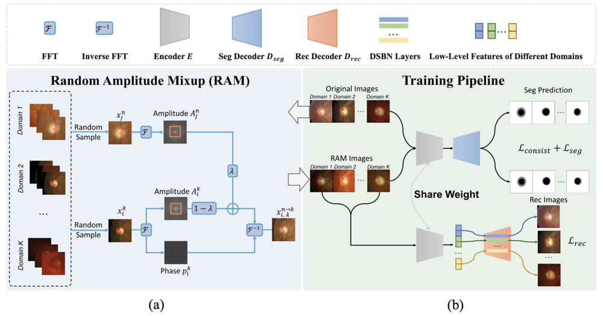 |<li> Title: <a href="https://link.springer.com/chapter/10.1007/978-3-031-19803-8_25">Generalizable Medical Image Segmentation via Random Amplitude Mixup and Domain-Specific Image Restoration</a></li> <li>Publication: ECCV 2022 </li> <li>Summary: Present a continuous frequency space interpolation mechanism for cross-site fundus and prostate segmentation, which exchanges amplitude spectrum (style) to generate new samples while keeping the phase spectrum (semantic) </li> <li> Code: <a href="https://github.com/zzzqzhou/RAM-DSIR">https://github.com/zzzqzhou/RAM-DSIR</a></li>|
|  |<li> Title: <a href="https://ieeexplore.ieee.org/abstract/document/9761606">Domain Generalization in Restoration of Cataract Fundus Images Via High-Frequency Components</a></li> <li>Publication: ISBI 2022 </li> <li>Summary: Cataract-like fundus images are randomly synthesized from an identical clear image by adding cataractous blurry. Then, high-frequency components are extracted from the cataract-like images to reduce the domain shift and achieve domain alignment. </li> <li> Code: <a href="https://github.com/HeverLaw/Restoration-of-Cataract-Images-via-Domain-Generalization">https://github.com/HeverLaw/Restoration-of-Cataract-Images-via-Domain-Generalization</a></li>|
|  |<li> Title: <a href="https://openaccess.thecvf.com/content/CVPR2021/html/Liu_FedDG_Federated_Domain_Generalization_on_Medical_Image_Segmentation_via_Episodic_CVPR_2021_paper.html">FedDG: Federated Domain Generalization on Medical Image Segmentation via Episodic Learning in Continuous Frequency Space</a></li> <li>Publication: CVPR 2021 </li> <li>Summary: Propose a continuous frequency space interpolation mechanism for federated medical domain generalization, which exchanges amplitude spectrum across clients to transmit the distribution information, while keeping the phase spectrum with core semantics locally for privacy protection. </li> <li> Code: <a href="https://github.com/liuquande/FedDG-ELCFS">https://github.com/liuquande/FedDG-ELCFS</a></li>|

**Feature-space**

| Diagram | Descriptions |
|:-----------------:|:------------|
|  |<li> Title: <a href="https://www.frontiersin.org/articles/10.3389/fcvm.2020.00105/full">Improving the Generalizability of Convolutional Neural Network-Based Segmentation on CMR Images</a></li> <li>Publication: Frontiers in Cardiovascular Medicine 2020 </li> <li>Summary: Propose a simple yet effective way for improving the network generalization ability by carefully designing data normalization and augmentation strategies. </li>|

#### Adversarial-based
Adversarial-based data augmentation methods are driven by adversarial training, aiming to maximize the diversity of data while simultaneously constraining its reliability.

| Diagram | Descriptions |
|:-----------------:|:------------|
|  |<li> Title: <a href="https://ieeexplore.ieee.org/abstract/document/9837077">AADG: Automatic Augmentation for Domain Generalization on Retinal Image Segmentation</a></li> <li>Publication: TMI 2022 </li> <li>Summary: Introduce a novel proxy task maximizing the diversity among multiple augmented novel domains as measured by the Sinkhorn distance in a unit sphere space to achieve automated augmentation. Adversarial training and deep reinforcement learning are employed to efficiently search the objectives. </li> <li> Code: <a href="https://github.com/CRazorback/AADG">https://github.com/CRazorback/AADG</a></li>|
| 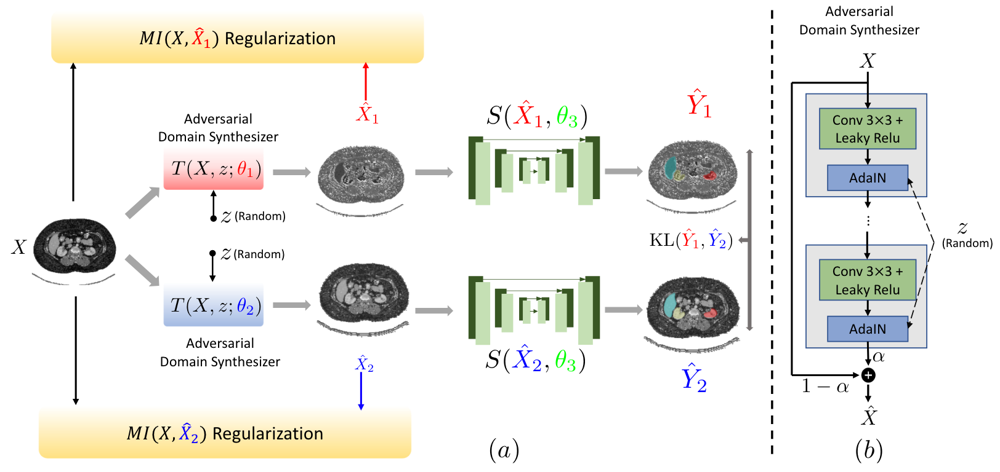 |<li> Title: <a href="https://link.springer.com/chapter/10.1007/978-3-031-16449-1_64">Adversarial Consistency for Single Domain Generalization in Medical Image Segmentation</a></li> <li>Publication: MICCAI 2022 </li> <li>Summary: Synthesize the new domains via learning an adversarial domain synthesizer (ADS), and propose to keep the underlying semantic information between the source image and the synthetic image via a mutual information regularizer. </li>|
|  |<li> Title: <a href="https://link.springer.com/chapter/10.1007/978-3-031-16443-9_15">MaxStyle: Adversarial Style Composition for Robust Medical Image Segmentation</a></li> <li>Publication: MICCAI 2022 </li> <li>Summary: Propose a data augmentation framework called MaxStyle, which augments data with improved image style diversity and hardness, by expanding the style space with noise and searching for the worst-case style composition of latent features via adversarial training. </li> <li> Code:<a href="https://github.com/cherise215/MaxStyle">https://github.com/cherise215/MaxStyle</a></li>|
|  |<li> Title: <a href="https://arxiv.org/abs/2304.02720">Domain Generalization with Adversarial Intensity Attack for Medical Image Segmentation</a></li> <li>Publication: Arxiv 2023 </li> <li>Summary: Propose Adversarial Intensity Attack (AdverIN) that introduce an adversarial attack on the data intensity distribution, which leverages adversarial training to generate training data with an infinite number of styles and increase data diversity while preserving essential content information. </li>|
|  |<li> Title: <a href="https://openaccess.thecvf.com/content/CVPR2023/html/Tomar_TeSLA_Test-Time_Self-Learning_With_Automatic_Adversarial_Augmentation_CVPR_2023_paper.html">TeSLA: Test-Time Self-Learning With Automatic Adversarial Augmentation</a></li> <li>Publication: CVPR 2023 </li> <li>Summary: Propose a method that combines knowledge distillation with adversarial-based data augmentation for cross-site medical image segmentation tasks. </li> <li> Code:<a href="https://github.com/devavratTomar/TeSLA">https://github.com/devavratTomar/TeSLA</a></li>|

### Data Generation
> Data generation is devoted to utilizing generative models such as Variational Autoencoder (VAE), Generative Adversarial Networks (GANs), Diffusion Models and etc., to generate fictional and novel samples. With source domain data becoming more complex, diverse, and informative, the generalization ability can be increased.

| Diagram | Descriptions |
|:-----------------:|:------------|
|  |<li> Title: <a href="https://link.springer.com/article/10.1007/s00530-023-01059-0">GH-DDM: the generalized hybrid denoising diffusion model for medical image generation</a></li> <li>Publication: Multimedia Systems 2023 </li> <li>Summary: Introduce a generalized hybrid denoising diffusion model to enhance generalization ability by generating new cross-domain medical images, which leverages the strong abilities of transformers into diffusion models to model long-range interactions and spatial relationships between anatomical structures. </li>|
|  |<li> Title: <a href="https://link.springer.com/chapter/10.1007/978-3-031-16434-7_12">Test-Time Image-to-Image Translation Ensembling Improves Out-of-Distribution Generalization in Histopathology</a></li> <li>Publication: MICCAI 2022 </li> <li>Summary: Utilize multi-domain image-to-image translation model StarGanV2 and projects histopathology test images from unseen domains to the source domains, classify the projected images and ensemble their predictions. </li> <li> Code:<a href="https://gitlab.com/vitadx/articles/test-time-i2i-translation-ensembling">https://gitlab.com/vitadx/articles/test-time-i2i-translation-ensembling</a></li>|
|  |<li> Title: <a href="https://proceedings.mlr.press/v172/hu22a.html">Domain Generalization for Retinal Vessel Segmentation with Vector Field Transformer</a></li> <li>Publication: PMLR 2022 </li> <li>Summary: Apply auto-encoder to generate different styles of enhanced vessel maps for augmentation and uses Hessian matrices of an image for segmentation as vector fields better capture the morphological features and suffer less from covariate shift. </li> <li> Code:<a href="https://github.com/MedICL-VU/Vector-Field-Transformer">https://github.com/MedICL-VU/Vector-Field-Transformer</a></li>|
|  |<li> Title: <a href="https://link.springer.com/chapter/10.1007/978-3-031-25069-9_14">CIRCLe: Color Invariant Representation Learning for Unbiased Classification of Skin Lesions</a></li> <li>Publication: ECCV Workshop 2022 </li> <li>Summary: Use a Star Generative Adversarial Network (StarGAN) to transform skin types (style), and enforce the feature representation to be invariant across different skin types. </li> <li><a href="https://github.com/arezou-pakzad/CIRCLe">https://github.com/arezou-pakzad/CIRCLe</a></li>|
|  |<li> Title: <a href="https://openaccess.thecvf.com/content/CVPR2021/html/Li_Semantic_Segmentation_With_Generative_Models_Semi-Supervised_Learning_and_Strong_Out-of-Domain_CVPR_2021_paper.html">Semantic Segmentation with Generative Models: Semi-Supervised Learning and Strong Out-of-Domain Generalization</a></li> <li>Publication: CVPR 2021 </li> <li>Summary: Propose a fully generative approach to semantic segmentation based on StyleGAN2, that models the joint image-label distribution and synthesizes both images and their semantic segmentation masks. </li> <li> Code:<a href="https://github.com/nv-tlabs/semanticGAN_code">https://github.com/nv-tlabs/semanticGAN_code</a></li>|
|  |<li> Title: <a href="https://link.springer.com/chapter/10.1007/978-3-030-92270-2_24">Generative Adversarial Domain Generalization via Cross-Task Feature Attention Learning for Prostate Segmentation</a></li> <li>Publication: ICONIP 2021 </li> <li>Summary: Propose a new Generative Adversarial Domain Generalization (GADG) network, which can achieve the domain generalization through the generative adversarial learning on multi-site prostate MRI images. Additionally, to make the prostate segmentation network learned from the source domains still have good performance in the target domain, a Cross-Task Attention Module (CTAM) is designed to transfer the main domain generalized features from the generation branch to the segmentation branch. </li>|
|  |<li> Title: <a href="https://ieeexplore.ieee.org/document/9503389">Learning Domain-Agnostic Visual Representation for Computational Pathology Using Medically-Irrelevant Style Transfer Augmentation</a></li> <li>Publication: TMI 2021 </li> <li>Summary: Propose a style transfer-based aug- mentation (STRAP) method for a tumor classification task, which applies style transfer from non-medical images to histopathology images. </li> <li> Code:<a href="https://github.com/rikiyay/style-transfer-for-digital-pathology">https://github.com/rikiyay/style-transfer-for-digital-pathology</a></li>|
|  |<li> Title: <a href="https://link.springer.com/chapter/10.1007/978-3-030-78191-0_51">Multimodal Self-supervised Learning for Medical Image Analysis</a></li> <li>Publication: IPMI 2021 </li> <li>Summary: Propose a novel approach leveraging self-supervised learning through multimodal jigsaw puzzles for cross-modal medical image synthesis tasks. Additionally, to increase the quantity of multimodal data, they design a cross-modal generation step to create synthetic images from one modality to another using the CycleGAN-based translation model.|
|  |<li> Title: <a href="https://link.springer.com/chapter/10.1007/978-3-030-68107-4_21">Random Style Transfer Based Domain Generalization Networks Integrating Shape and Spatial Information</a></li> <li>Publication: STACOM 2020 </li> <li>Summary: Propose novel random style transfer based domain general- ization networks incorporating spatial and shape information based on GANs.  </li>|

## Feature Level Generalization
### Invariant Feature Representation
>For medical image analysis, a well-generalized model focuses more on task-related semantic features while disregarding task-unrelated style features. In this regard, three types of methods have been extensively investigated: feature normalization, explicit feature alignment, and domain adversarial learning.

#### Feature normalization 
This line of methods aim to enhance the generalization ability of models by centering, scaling, decorrelating, standardizing, and whitening extracted feature distributions. This process aids in accelerating the convergence of algorithms and prevents features with larger scales from overpowering those with smaller ones. Common techniques include traditional scaling methods like min-max and z-score normalization, as well as deep learning methods such as batch, layer, and instance normalization.

| Diagram | Descriptions |
|:-----------------:|:------------|
|  |<li> Title: <a href="https://www.sciencedirect.com/science/article/pii/S0010482523001828">SAN-Net: Learning generalization to unseen sites for stroke lesion segmentation with self-adaptive normalization</a></li> <li>Publication: CBM 2023 </li> <li>Summary: Devise a masked adaptive instance normalization to minimize inter-sites discrepancies for cross-sites stroke lesion segmentation, which standardized input images from different sites into a domain-unrelated style by dynamically learning affine parameters.  </li> <li> Code:<a href="https://github.com/wyyu0831/SAN">https://github.com/wyyu0831/SAN</a></li>|
|  |<li> Title: <a href="https://ietresearch.onlinelibrary.wiley.com/doi/full/10.1049/ipr2.12782">SS-Norm: Spectral-spatial normalization for single-domain generalization with application to retinal vessel segmentation</a></li> <li>Publication: IET IP 2023 </li> <li>Summary: Decompose the feature into multiple frequency components by performing discrete cosine transform and analyze the semantic contribution degree of each component. Then reweight the frequency components of features and therefore normalize the distribution in the spectral domain.  </li>|
|  |<li> Title: <a href="https://openaccess.thecvf.com/content/CVPR2022/html/Zhou_Generalizable_Cross-Modality_Medical_Image_Segmentation_via_Style_Augmentation_and_Dual_CVPR_2022_paper.html">Generalizable Cross-modality Medical Image Segmentation via Style Augmentation and Dual Normalization</a></li> <li>Publication: CVPR 2022 </li> <li>Summary: Design a dual-normalization module to estimate domain distribution information. During the test stage, the model select the nearest feature statistics according to style-embeddings in the dual-normalization module to normalize target domain features for generalization.  </li> <li> Code:<a href="https://github.com/zzzqzhou/Dual-Normalization">https://github.com/zzzqzhou/Dual-Normalization</a></li>|

#### Explicit feature alignment
Explicit feature alignment methods attempt to remove domain shifts by reducing the discrepancies in feature distributions across multiple source domains, thereby facilitating the learning of domain-invariant feature representations.

| Diagram | Descriptions |
|:-----------------:|:------------|
|  |<li> Title: <a href="https://proceedings.neurips.cc/paper_files/paper/2020/file/201d7288b4c18a679e48b31c72c30ded-Paper.pdf">Domain Generalization for Medical Imaging Classification with Linear-Dependency Regularization</a></li> <li>Publication: NeurIPS 2020 </li> <li>Summary: Adopt Kullback-Leibler (KL) divergence to align the distributions of latent features extracted from multiple source domains with a predefined prior distribution.  </li> <li> Code:<a href="https://github.com/wyf0912/LDDG">https://github.com/wyf0912/LDDG</a></li>|
|  |<li> Title: <a href="https://ieeexplore.ieee.org/abstract/document/9234592">Measuring Domain Shift for Deep Learning in Histopathology</a></li> <li>Publication: JBHI 2020 </li> <li>Summary: Design a dual-normalization module to estimate domain distribution information. During the test stage, the model select the nearest feature statistics according to style-embeddings in the dual-normalization module to normalize target domain features for generalization. </li> <li>Code:<a href="https://github.com/zzzqzhou/Dual-Normalization">https://github.com/zzzqzhou/Dual-Normalization</a></li>|

#### Domain adversarial learning
Domain-adversarial training methods are widely used for learning domain-invariant representations by introducing a domain discriminator in an adversarial relationship with the feature extractor

| Diagram | Descriptions |
|:-----------------:|:------------|
| 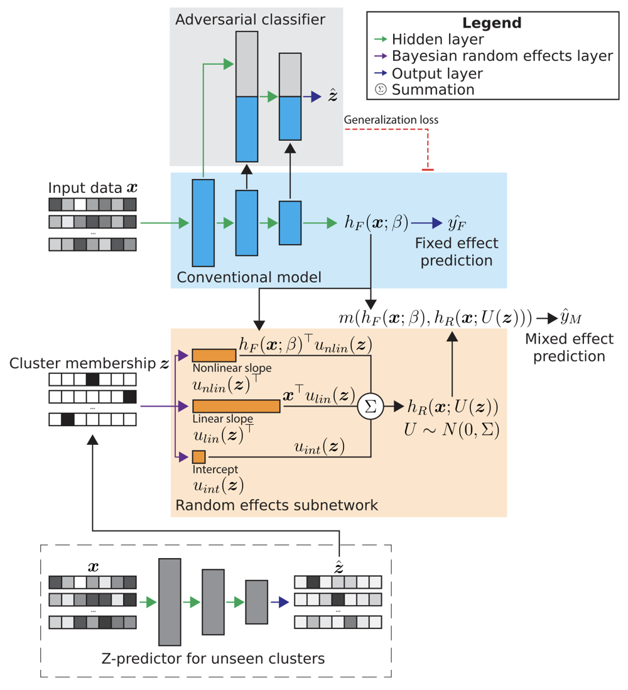 |<li> Title: <a href="https://ieeexplore.ieee.org/abstract/document/10016237">Adversarially-Regularized Mixed Effects Deep Learning (ARMED) Models Improve Interpretability, Performance, and Generalization on Clustered (non-iid) Data</a></li> <li>Publication: IEEE TPAMI 2023 </li> <li>Summary: Propose a general-purpose framework for Adversarially-Regularized Mixed Effects Deep learning (ARMED). The ARMED employ an adversarial classifier to regularize the model to learn cluster-invariant fixed effects (domain invariant). The classifier attempts to predict the cluster membership based on the learned features, while the feature extractor is penalized for enabling this prediction. </li>|
| 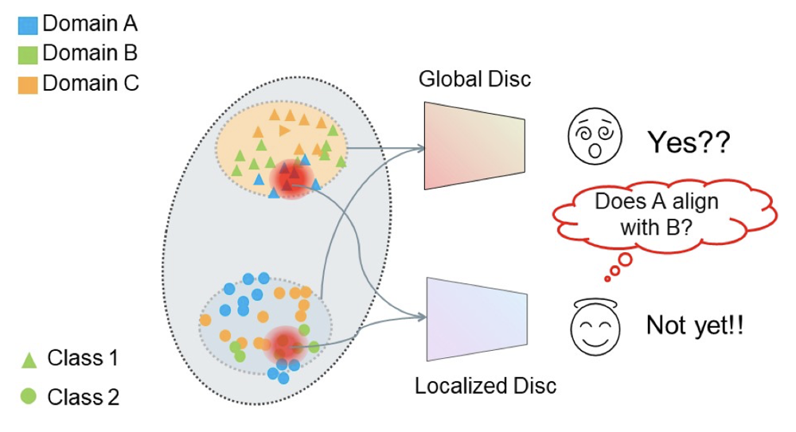 |<li> Title: <a href="https://openaccess.thecvf.com/content/CVPR2022/html/Zhu_Localized_Adversarial_Domain_Generalization_CVPR_2022_paper.html">Localized adversarial domain generalization</a></li> <li>Publication: CVPR 2022 </li> <li>Summary: Propose a general-purpose framework for Adversarially-Regularized Mixed Effects Deep learning (ARMED). The ARMED employ an adversarial classifier to regularize the model to learn cluster-invariant fixed effects (domain invariant). The classifier attempts to predict the cluster membership based on the learned features, while the feature extractor is penalized for enabling this prediction. </li> <li>Code:<a href="https://github.com/zwvews/LADG">https://github.com/zwvews/LADG</a></li>|

### Feature disentanglement
>Feature disentanglement methods aim to decompose the features of input samples into domain-invariant (task-unrelated) and domain-specific (task-related) components, i.e., $\mathbf{z} = [\mathbf{z}_\text{invariant}, \mathbf{z}_\text{specific}] \in \mathcal{Z}$. The objective of robust generalization models is to concentrate exclusively on the task-related feature components $\mathbf{z}_\text{invariant}$ while disregarding the task-unrelated ones $\mathbf{z}_\text{specific}$. The mainstream methods of feature disentanglement mainly include multi-component learning and generative modeling.

#### Multi-component learning
Multi-component learning achieves feature disentanglement by designing different components to separately extract domain-invariant features and domain-specific features, thereby achieving feature decoupling.

| Diagram | Descriptions |
|:-----------------:|:------------|
|  |<li> Title: <a href="https://arxiv.org/abs/2303.12649">MI-SegNet: Mutual Information-Based US Segmentation for Unseen Domain Generalization</a></li> <li>Publication: MICCAI 2023 </li> <li>Summary: Propose MI-SegNet for ultrasound image segmentation. MI-SegNet employs two encoders that separately extract anatomical and domain features from images, and Mutual Information Neural Estimation (MINE) approximation is used to minimize the mutual information between these features. </li>|
|  |<li> Title: <a href="https://openaccess.thecvf.com/content/CVPR2022/html/Zhang_Towards_Principled_Disentanglement_for_Domain_Generalization_CVPR_2022_paper.html">Towards principled disentanglement for domain generalization</a></li> <li>Publication: CVPR 2022 </li> <li>Summary: Introduce disentanglement-constrained domain generalization (DDG) for cross-center tumor detection, which simultaneously learns a semantic encoder and a variation encoder for feature disentanglement, and further constrains the learned representations to be invariant to inter-class variation. </li>|
|  |<li> Title: <a href="https://arxiv.org/abs/2205.06551">Contrastive Domain Disentanglement for Generalizable Medical Image Segmentation</a></li> <li>Publication: Arxiv 2022 </li> <li>Summary: Propose Contrastive Domain Disentanglement and Style Augmentation (CDDSA) for image segmentation in the fundus and MR images. This method introduce a disentangle network to decompose medical images into an anatomical representation and a modality representation, and a style contrastive loss function is designed to ensures that style representations from the same domain bear similarity while those from different domains diverge significantly. </li>|

#### Generative Learning
Generative models are also effective techniques for traditional feature disentanglement, such as InfoGAN and $\beta$-VAE. For domain generalization, generative learning based disentanglement methods attempt to elucidate the sample generation mechanisms from the perspectives of domain, sample, and label, thereby achieving feature decomposition.

| Diagram | Descriptions |
|:-----------------:|:------------|
|  | <li>Title: <a href="https://www.researchgate.net/profile/Yizhou-Yu-2/publication/372230975_LEARNING_DOMAIN-AGNOSTIC_REPRESENTATION_FOR_DISEASE_DIAGNOSIS/links/64aacef58de7ed28ba8841c2/LEARNING-DOMAIN-AGNOSTIC-REPRESENTATION-FOR-DISEASE-DIAGNOSIS.pdf">Learning domain-agnostic representation for disease diagnosiss</a></li>   <li>Publication: ICLR 2023 </li> <li>Summary: Leverage structural causal modeling to explicitly model disease-related and center-effects. Guided by this, propose a novel Domain Agnostic Representation Model (DarMo) based on variational Auto-Encoder and design domain-agnostic and domain-aware encoders to respectively capture disease-related features and varied center effects by incorporating a domain-aware batch normalization layer. </li>|
|  | <li>Title: <a href="https://link.springer.com/chapter/10.1007/978-3-031-43898-1_24">DiMix: Disentangle-and-Mix Based Domain Generalizable Medical Image Segmentation</a></li> <li>Publication: MICCAI 2023 </li> <li>Summary: Combine vision transformer architectures with style-based generators for cross-site medical segmentation. It learned domain-invariant representations by swapping domain-specific features, facilitating the disentanglement of content and styles. </li>|
| |<li>Title: <a href="http://proceedings.mlr.press/v121/ilse20a.html">DIVA: Domain Invariant Variational Autoencoders</a></li> <li>Publication: PLMR 2022 </li> <li>Summary: Propose Domain-invariant variational autoencoder (DIVA) for malaria cell image classification, which disentangles the features into domain information, category information, and other information, which is learned in the VAE framework. </li> <li>Code: <a href="https://github.com/AMLab-Amsterdam/DIVA">https://github.com/AMLab-Amsterdam/DIVA</a>|
| |<li> Title: <a href="https://arxiv.org/abs/2109.05826">Variational Disentanglement for Domain Generalization</a></li> <li>Publication: TMLR 2022 </li> <li>Summary: Propose a Variational Disentanglement Network (VDN) to classify breast cancer metastases. VDN disentangles domain-invariant and domain-specific features by estimating the information gain and maximizing the posterior probability. </li>|

## Model Training Level 

### Learning Strategy
>Learning strategies have gained significant attention in tackling domain generalization challenges across various fields. They leverage generic learning paradigms to improve model generalization performance, which can be mainly categorized into three categories: ensemble learning, meta-learning, and self-supervised learning.

#### Ensemble Learning
Ensemble learning is a machine learning technique where multiple models are trained to solve the same problem. For domain generalization, different models can capture domain-specific patterns and representations, so their combination could lead to more robust predictions.

| Diagram | Descriptions |
|:-----------------:|:------------|
|  | <li>Title: <a href="https://www.sciencedirect.com/science/article/pii/S0950705123002708">Mixture of calibrated networks for domain generalization in brain tumor segmentation Data</a></li> <li>Publication: KBS 2023 </li> <li>Summary: Design the mixture of calibrated networks (MCN) for cross-domain brain tumor segmentation, which combines the predictions from multiple models, and each model has unique calibration characteristics to generate diverse and fine-grained segmentation map. </li>|
|  | <li>Title: <a href="https://www.sciencedirect.com/science/article/pii/S1361841521003571">DeepLesionBrain: Towards a broader deep-learning generalization for multiple sclerosis lesion segmentation</a></li> <li>Publication: MedIA 2021 </li> <li>Summary: Use a large group of compact 3D CNNs spatially distributed over the brain regions and associate a distinct network with each region of the brain, thereby producing consensus-based segmentation robust to domain shift. </li>|
|  | <li>    Title: <a href="https://ieeexplore.ieee.org/abstract/document/9000851">MS-Net: Multi-Site Network for Improving Prostate Segmentation With Heterogeneous MRI Data</a></li> <li>Publication: IEEE TMI 2020 </li> <li>Summary: Propose multi-site network (MS-Net) for cross-site prostate segmentation, which consists of a universal network and multiple domain-specific auxiliary branches. The universal network is trained with the supervision of ground truth and transferred multi-site knowledge from auxiliary branches to help explore the general representation. </li> <li>Code: <a href="https://github.com/liuquande/MS-Net">https://github.com/liuquande/MS-Net</a>|

#### Meta Learning
Meta-learning, also known as learning to learn, is a machine learning method focused on designing algorithms that can generalize knowledge from diverse tasks. In medical domain generalization tasks, it plays a significant role in addressing the challenge of expensive data collecting and annotating, which divide the source domain(s) into meta-train and meta-test sets to simulate domain shift.

| Diagram | Descriptions |
|:-----------------:|:------------|
|  | <li>Title: <a href="https://openaccess.thecvf.com/content/CVPR2021/html/Liu_FedDG_Federated_Domain_Generalization_on_Medical_Image_Segmentation_via_Episodic_CVPR_2021_paper.html">FedDG: Federated Domain Generalization on Medical Image Segmentation via Episodic Learning in Continuous Frequency Space</a></li> <li>Publication: CVPR 2021 </li> <li>Summary: Introduce episodic meta-learning for federated medical image segmentation. During the training process of local models, the raw input serves as the meta-train data, while its counterparts generated from frequency space are used as the meta-test data, helping in learning generalizable model parameters. </li> <li>Code: <a href="https://github.com/liuquande/FedDG-ELCFS">https://github.com/liuquande/FedDG-ELCFS</a>|
|  | <li>    Title: <a href="https://link.springer.com/chapter/10.1007/978-3-030-59713-9_46">Shape-Aware Meta-learning for Generalizing Prostate MRI Segmentation to Unseen Domains</a></li> <li>Publication: MICCAI 2020 </li> <li>Summary: Propose a shape-aware meta-learning (SAML) scheme for the prostate MRI segmentation, rooted in gradient-based meta-learning. It explicitly simulates domain shift during training by dividing virtual meta-train and meta-test sets. </li> <li>Code: <a href="https://github.com/liuquande/SAML">https://github.com/liuquande/SAML</a>|

#### Self-supervised Learning
Self-supervised learning is a machine learning method where a model learns general representations from input data without explicit supervision. These representations enhance the model's generalization capability, enabling it to mitigate domain-specific biases. This approach is particularly valuable in scenarios where labeled data is scarce or costly to obtain and annotate, such as in medical imaging.

| Diagram | Descriptions |
|:-----------------:|:------------|
| 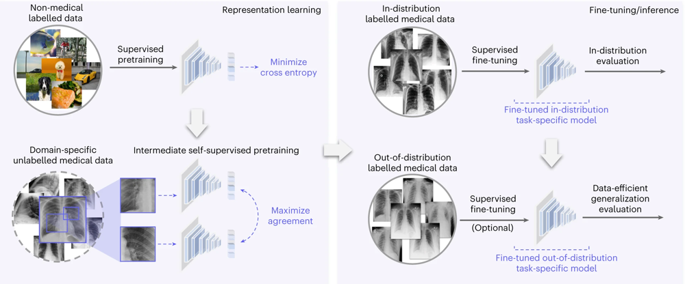 | <li>Title: <a href="https://www.nature.com/articles/s41551-023-01049-7">Robust and data-efficient generalization of self-supervised machine learning for diagnostic imaging</a></li> <li>Publication: Nature Biomedical Engineering 2023 </li> <li> Summary: Propose robust and efficient medical imaging with self-supervision (REMEDIS) for technology, demographic and behavioral domain shifts, which combines large-scale supervised transfer learning on natural images and intermediate contrastive self-supervised learning on medical images and requires minimal task-specific customization.</li>|
|  | <li>    Title: <a href="https://link.springer.com/chapter/10.1007/978-3-031-43987-2_13">Frequency-Mixed Single-Source Domain Generalization for Medical Image Segmentation</a></li> <li>Publication: MICCAI 2023 </li> <li>Summary: Leverage frequency-based augmentation technique to extend the single-source domain discrepancy and constructed self-supervision in the single domain augmentation to learn robust context-aware representations for the fundus vessels segmentation. </li> <li>Code: <a href="https://github.com/liamheng/Non-IID_Medical_Image_Segmentation">https://github.com/liamheng/Non-IID_Medical_Image_Segmentation</a>|

### Optimization Strategy
>Optimization strategies play a crucial role in minimizing overfitting to specific domains, which is achieved by adjusting hyperparameters, selecting appropriate loss functions, regularization techniques, and optimization algorithms.

| Diagram | Descriptions |
|:-----------------:|:------------|
|  | <li>  Title: <a href="https://proceedings.neurips.cc/paper/2021/hash/a8f12d9486cbcc2fe0cfc5352011ad35-Abstract.html">Model-Based Domain Generalization</a></li> <li>Publication: NeurIPS 2021 </li> <li>Summary: Present a model-based domain generalization framework to rigorously reformulate the domain generalization problem as a semi-infinite constrained optimization problem. employed group distributionally robust optimization (GDRO) for the skin lesion classification model. This optimization involves more aggressive regularization, implemented through a hyperparameter to favor fitting smaller groups, and early stopping techniques to enhance generalization performance. </li> <li>Code: <a href="https://github.com/arobey1/mbdg">https://github.com/arobey1/mbdg</a>|
| 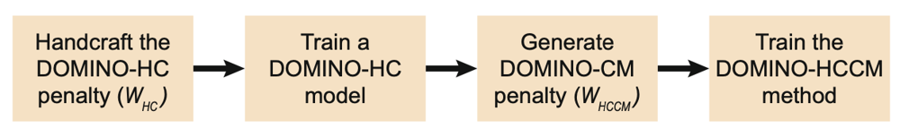 | <li> Title: <a href="https://link.springer.com/chapter/10.1007/978-3-031-43901-8_68">DOMINO++: Domain-Aware Loss Regularization for Deep Learning Generalizability</a></li> <li>Publication: MICCAI 2023 </li> <li>Summary: Introduce an adaptable regularization framework to calibrate intracranial MRI segmentation models based on expert-guided and data-guided knowledge. The strengths of this regularization lie in its ability to take advantage of the benefits of both the semantic confusability derived from domain knowledge and data distribution. </li>|

## Model Test Level
### Test-time Adaptation

| Diagram | Descriptions |
|:-----------------:|:------------|
| 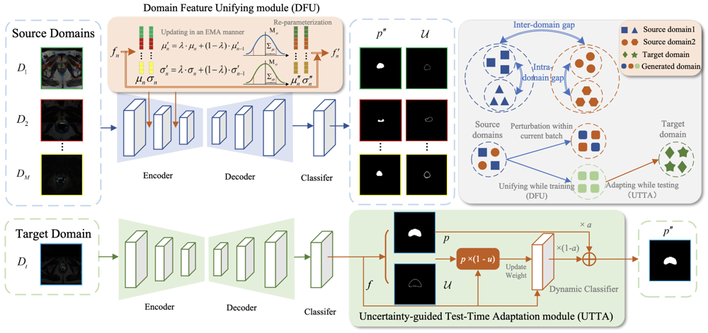 |<li> Title: <a href="https://ieeexplore.ieee.org/abstract/document/10816643">UniAda: Domain Unifying and Adapting Network for Generalizable Medical Image Segmentation</a></li> <li>Setting: MDG </li> <li>Publication: IEEE TMI 2024 </li> <li>Summary: Propose a domain Unifying and Adapting network (UniAda) with DFU and UTTA module for generalizable medical image segmentation, a novel "unifying while training, adapting while testing" paradigm that can learn a domain-aware base model during training and dynamically adapt it to unseen target domains during testing. The DFU module unifies multi-source domains into a global inter-source domain through a novel feature statistics update mechanism, capable of sampling new features for previously unseen domains, thus enhancing the training of a domain-aware base model. The UTTA module leverages an uncertainty map to guide the adaptation of the trained model for each testing sample, considering the possibility that the specific target domain may fall outside the global inter-source domain. </li> <li>Code: <a href="https://github.com/ZhouZhang233/UniAda">https://github.com/ZhouZhang233/UniAda</a>|
|  |<li> Title: <a href="https://ojs.aaai.org/index.php/AAAI/article/view/20068">Single-Domain Generalization in Medical Image Segmentation via Test-Time Adaptation from Shape Dictionary</a></li> <li>Setting: SDG </li> <li>Publication: AAAI 2022 </li> <li>Summary: Present a SDG approach that extracts and integrates the semantic shape prior information of segmentation that are invariant across domains and can be well-captured even from single domain data to facilitate segmentation under distribution shifts. Besides, a test-time adaptation strategy with dual-consistency regularization is further devised to promote dynamic incorporation of these shape priors under each unseen domain to improve model generalizability.|

## Universal Foundation Model
>Medical image segmentation tasks encompass diverse imaging modalities, such as magnetic resonance imaging (MRI), X-ray, computed tomography (CT), and microscopy; various biomedical domains, including the abdomen, chest, brain, retina, and individual cells; and multiple label types within a region, such as heart valves or chambers. Traditional task-specific models are designed to train and test on a single, specific dataset. In contrast, universal foundation models aim to learn a single, generalizable medical image segmentation model capable of performing well across a wide range of tasks, including those significantly different from those encountered during training, without requiring retraining.

### Survey
| Diagram | Descriptions |
|:-----------------:|:------------|
|  |<li> Title: <a href="https://arxiv.org/pdf/2310.18689">Foundational models in medical imaging: A comprehensive survey and future vision</a></li> <li>Publication: Arxiv 2023 </li> <li>Summary: This survey provides an in-depth review of recent advancements in foundational models for medical imaging. It categorizes these models into four main groups, distinguishing between those prompted by text and those guided by visual cues. Each category presents unique strengths and capabilities, which are further explored through exemplary works and comprehensive methodological descriptions. Furthermore, this survey evaluates the advantages and limitations inherent to each model type, highlighting their areas of excellence while identifying aspects requiring improvement.  </li> <li>Repo: <a href="https://github.com/xmindflow/Awesome-Foundation-Models-in-Medical-Imaging">https://github.com/xmindflow/Awesome-Foundation-Models-in-Medical-Imaging</a>|

### Visual Prompted Models
#### Interactive
>Interactive segmentation paradigm means the foundation model segments the target following the user-given prompts, such as a point, a bounding box (BBox), doodles or free text-like descriptions.

| Diagram | Descriptions |
|:-----------------:|:------------|
| 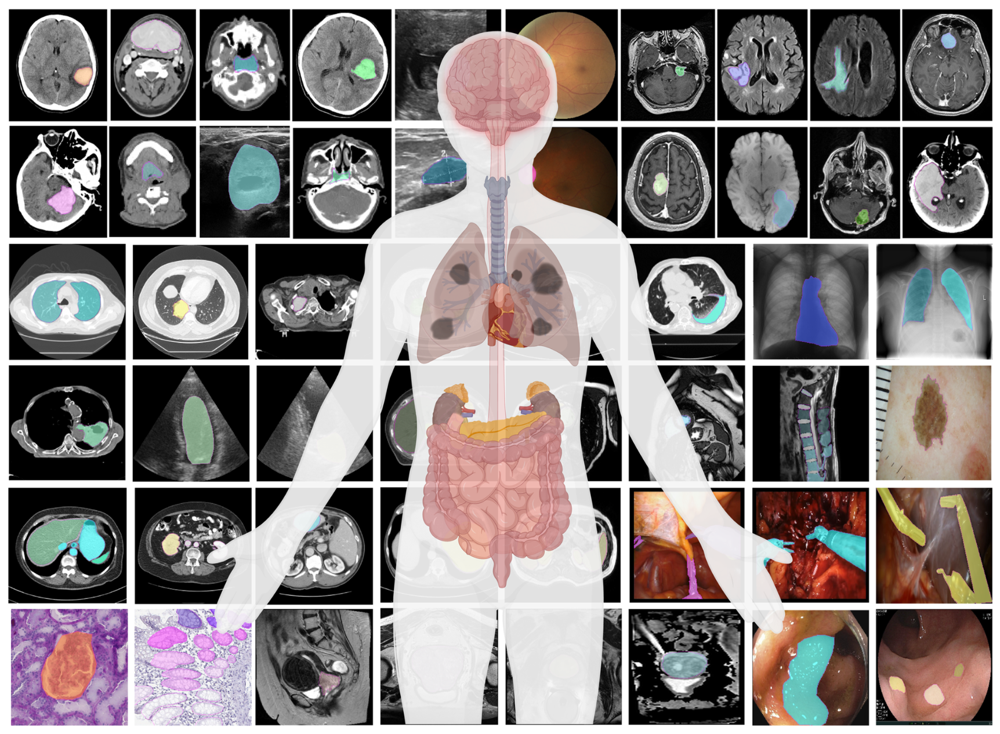 |<li> Title: <a href="https://www.nature.com/articles/s41467-024-44824-z">Segment anything in medical images</a></li> <li>Publication: Nature Communications 2024 </li> <li>Summary: Present MedSAM, a foundation model designed for bridging this gap by enabling universal medical image segmentation. The model is developed on a large-scale medical image dataset with 1,570,263 image-mask pairs, covering 10 imaging modalities and over 30 cancer types. </li> <li>Code: <a href="https://github.com/bowang-lab/MedSAM">https://github.com/bowang-lab/MedSAM</a>|
|  |<li> Title: <a href="https://link.springer.com/chapter/10.1007/978-3-031-73661-2_12">ScribblePrompt: Fast and Flexible Interactive  Segmentation for Any Biomedical Image</a></li> <li>Publication: ECCV 2024 </li> <li>Summary: Present ScribblePrompt, a flexible neural network based interactive segmentation tool for biomedical imaging that enables human annotators to segment previously unseen structures using scribbles, clicks, and bounding box. ScribblePrompt’s success rests on a set of careful design decisions. These include a training strategy that incorporates both a highly diverse set of images and tasks, novel algorithms for simulated user interactions and labels, and a network that enables fast inference. </li> <li>Code: <a href="https://scribbleprompt.csail.mit.edu">https://scribbleprompt.csail.mit.edu</a>|

#### Few-shot/One-shot
>In few-shot/one-shot setting, a pre-trained foundationa model needs one or few labeled samples as the ’supportive examples’, to grasp a new specific task.

| Diagram | Descriptions |
|:-----------------:|:------------|
|  |<li> Title: <a href="https://openaccess.thecvf.com/content/CVPR2024/html/Wu_One-Prompt_to_Segment_All_Medical_Images_CVPR_2024_paper.html">One-Prompt to Segment All Medical Images</a></li> <li>Publication: CVPR 2024</li> <li>Introduce a new paradigm toward the universal medical image segmentation termed One-Prompt Segmentation which combines the strengths of one-shot and interactive methods. In the inference stage with just one prompted sample it can adeptly handle the unseen task in a single forward pass.</li> <li>Code: <a href="https://github.com/KidsWithTokens/one-prompt">https://github.com/KidsWithTokens/one-prompt</a>|
|  |<li> Title: <a href="https://openaccess.thecvf.com/content/ICCV2023/html/Butoi_UniverSeg_Universal_Medical_Image_Segmentation_ICCV_2023_paper.html">UniverSeg: Universal Medical Image Segmentation</a></li> <li>Publication: ICCV 2023</li> <li>Summary: Present UniverSeg, a universal segmentation method for solving unseen medical segmentation tasks without additional training. Given a query image and an example set of image-label pairs that define a new segmentation task, UniverSeg employs a new CrossBlock mechanism to produce accurate segmentation maps without additional training. What's more, 53 open-access medical segmentation datasets with over 22,000 scans were collected to train UniverSeg on a diverse set of anatomies and imaging modalities.</li> <li>Code: <a href="https://universeg.csail.mit.edu">https://universeg.csail.mit.edu</a>|

### Textual Prompted Models

#### Contrastive
>Contrastive textually prompted models are increasingly recognized as foundational models for medical imaging. They learn representations that capture the semantics and relationships between medical images and their corresponding textual prompts. By leveraging contrastive learning objectives, these models bring similar image-text pairs closer in the feature space while pushing dissimilar pairs apart.

| Diagram | Descriptions |
|:-----------------:|:------------|
|  |<li> Title: <a href="https://link.springer.com/chapter/10.1007/978-3-031-72378-0_67">MM-Retinal: Knowledge-Enhanced Foundational Pretraining with Fundus Image-Text Expertise</a></li> <li>Publication: MICCAI 2024</li> <li>Propose MM-Retinal, a multi-modal dataset that encompasses high-quality image-text pairs collected from professional fundus diagram books. Moreover, enabled by MM-Retinal, present a novel Knowledge-enhanced foundational pretraining model which incorporates Fundus Image-Text expertise. It is designed with image similarity-guided text revision and mixed training strategy to infuse expert knowledge.</li> <li>Code: <a href="https://github.com/lxirich/MM-Retinal">https://github.com/lxirich/MM-Retinal</a>|
|  |<li> Title: <a href="https://www.nature.com/articles/s41467-023-40260-7">Knowledge-enhanced Visual-Language Pre-training on Chest Radiology Images</a></li> <li>Publication: Nature Communications 2023</li> <li>Propose an approach called Knowledge-enhanced Auto Diagnosis (KAD) which leverages existing medical domain knowledge to guide vision-language pre-training using paired chest X-rays and radiology reports.</li>|

#### Generative

#### Conversational
>Conversational textually prompted models are designed to enable interactive dialogues between medical professionals and the model by fine-tuning foundational models on specific instruction sets. These models enhance communication and collaboration, allowing medical experts to ask questions, provide instructions, and seek explanations related to medical images.

| Diagram | Descriptions |
|:-----------------:|:------------|
|  |<li> Title: <a href="https://arxiv.org/pdf/2409.17508">Uni-Med: A Unified Medical Generalist Foundation Model For Multi-Task Learning Via Connector-MoE</a></li> <li>Publication: Neurips 2024</li> <li>Propose Uni-Med, a novel medical generalist foundation model consisting of a universal visual feature extraction module, a connector mixture-of-experts (CMoE) module, and a large language model (LLM). Benefiting from the proposed CMoE, which leverages a well-designed router with a mixture of projection experts at the connector, Uni-Med provides an efficient solution to the tug-of-war problem. It is capable of performing six different medical tasks, including question answering, visual question answering, report generation, referring expression comprehension, referring expression generation, and image classification.</li> <li>Code: <a href="https://github.com/MSIIP/Uni-Med">https://github.com/MSIIP/Uni-Med</a>|

# Datasets
> We list the widely used benchmark datasets for domain generalization including classification and segmentation. 

|                                                                 Dataset                                                                  | Task                       | #Domain | #Class |                                                                  Description                                                                 |
|:----------------------------------------------------------------------------------------------------------------------------------------:|----------------------------|:-------:|:------:|:-------------------------------------------------------------------------------------------------------------------------------------------:|
|                                 [Fundus OC/OD](https://drive.google.com/file/d/1p33nsWQaiZMAgsruDoJLyatoq5XAH-TH/view)                                 | Segmentation             |    4    |   2    |                                                           Retinal fundus RGB images from three public datasets, including REFUGE, DrishtiGSand RIM-ONE-r                                                         |
|                                 [Prostate MRI](https://liuquande.github.io/SAML/)                                 | Segmentation             |    6    |   1    |                                                     T2-weighted MRI data collected three public datasets, including NCI-ISBI13, I2CVB and PROMISE12                                                     |
|                             Abdominal [CT](https://www.synapse.org/#!Synapse:syn3193805/files/) & [MRI](https://zenodo.org/records/3431873#.Yl_9itpBxaQ)                              | Segmentation             |    2    |   4   |                                                         30 volumes Computed tomography (CT) and 20 volumes T2 spectral presaturation with inversion recovery (SPIR) MRI                                                         |
|                          [Cardiac](http://www.sdspeople.fudan.edu.cn/zhuangxiahai/0/mscmrseg19/)                          | Segmentation             |    2    |   3   |                                                            45 volumes balanced steady-state free precession (bSSFP) MRI and late gadolinium enhanced (LGE) MRI                                                             |
|                         [BraTS](https://www.med.upenn.edu/sbia/brats2018/data.html)                         | Segmentation             |    4    |   1   |                                                        Multi-contrast MR scans from glioma patients and consists of four different contrasts: T1, T1ce, T2, and FLAIR                                                        |
|                           [M\&Ms](https://www.ub.edu/mnms/)                            | Segmentation             |    4    |   3   |                                                          Multi-centre, multi-vendor and multi-disease cardiac image segmentation dataset contains 320 subjects                                                          |
|                      [SCGM](http://cmictig.cs.ucl.ac.uk/niftyweb/challenge/)                       | Segmentation             |    4    |   1   |                                                       Single channel spinal cord gray matter MRI from four different centers                                                       |
|                                            [Camelyon17](https://camelyon17.grand-challenge.org/?continueFlag=29313139355c1e1ceb8e2afcbc101f6f)                                             | Detection \& Classification             |    5    |   2   |                                                   Whole-slide images (WSI) of hematoxylin and eosin (H\&E) stained lymph node sections of 100 patients                                                   |
|                                            [Chest X-rays](http://proceedings.mlr.press/v139/mahajan21b.html)                                             | Classification             |    3    |   2    |                                                       Chest X-rays for detecting whether the image corresponds to a patient with Pneumonia from three dataset NIH, ChexPert and RSNA                                                       |
                     

# Libraries
> We list the libraries of domain generalization.
- [Transfer Learning Library (thuml)](https://github.com/thuml/Transfer-Learning-Library) for Domain Adaptation, Task Adaptation, and Domain Generalization.
- [DomainBed (facebookresearch)](https://github.com/facebookresearch/DomainBed)  is a suite to test domain generalization algorithms.
- [DeepDG (Jindong Wang)](https://github.com/jindongwang/transferlearning/tree/master/code/DeepDG): Deep domain generalization toolkit, which is easier then DomainBed.
- [Dassl (Kaiyang Zhou)](https://github.com/KaiyangZhou/Dassl.pytorch): A PyTorch toolbox for domain adaptation, domain generalization, and semi-supervised learning.
- [TorchSSL (Jindong Wang)](https://github.com/TorchSSL/TorchSSL): A open library for semi-supervised learning.

# Other Resources
- A collection of domain generalization papers organized by  [amber0309](https://github.com/amber0309/Domain-generalization).
- A collection of domain generalization papers organized by [jindongwang](https://github.com/jindongwang/transferlearning/blob/master/doc/awesome_paper.md#domain-generalization).
- A collection of papers on domain generalization, domain adaptation, causality, robustness, prompt, optimization, generative model, etc, organized by [yfzhang114](https://github.com/yfzhang114/Generalization-Causality).
- A collection of awesome things about domain generalization organized by [junkunyuan](https://github.com/junkunyuan/Awesome-Domain-Generalization).

# Contact
- If you would like to add/update the latest publications / datasets / libraries, please directly add them to this `README.md`.
- If you would like to correct mistakes/provide advice, please contact us by email (nzw@zju.edu.cn).
- You are welcomed to update anything helpful.

# Acknowledgements
- We refer to [Generalizing to Unseen Domains: A Survey on Domain Generalization](https://ieeexplore.ieee.org/abstract/document/9782500) to design the hierarchy of the [Contents](#contents).
- We refer to [junkunyuan](https://github.com/junkunyuan/Awesome-Domain-Generalization), [amber0309](https://github.com/amber0309/Domain-generalization), and [yfzhang114](https://github.com/yfzhang114/Generalization-Causality) to design the details of the papers and datasets.

# Contributors
<!-- readme: NaturalKnight,contributors,zerone-fg,contributors -start -->
<table>
<tr>
    <td align="center">
        <a href="https://github.com/naturalknight">
            
             
            <b>Null</b>
        </a>
    </td>
    <td align="center">
        <a href="https://github.com/Ziwei-Niu">
            
             
            <b>ZiweiNiu</b>
        </a>
    </td>
    <td align="center">
        <a href="https://github.com/zerone-fg">
            
             
            <b>Zerone-fg</b>
        </a>
    </td></tr>
</table>
<!-- readme: NaturalKnight,contributors,zerone-fg,contributors -end -->
